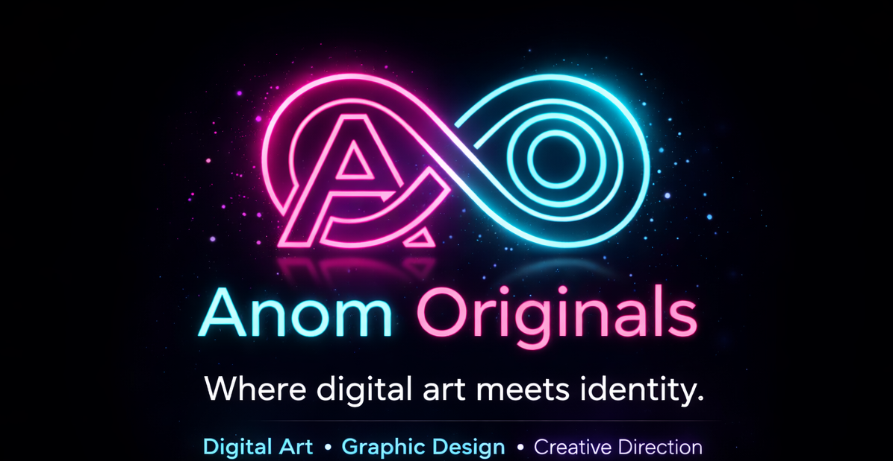

  

## ✦ ANOM ORIGINALS

Hi, I'm **Anom** — creator of **Anom Originals (AO)**.
I build digital spaces with mood, personality, and style-first creative direction.

*Identity in Every Pixel.*

---

## ✦ Live Right Now

- **[anomartsy.xyz](https://anomartsy.xyz)** — the AO homeworld: art, stories, games, and the kids corner
- **[The Anomoly Archive](https://anomarsty.lol)** — the AO digital art shop: backgrounds, emote sets, and profile art across four rarity tiers, Novelty → Curiosity → Relic → Anomoly
- **[AO Merch](https://anomoriginals.myspreadshop.com)** — wearable AO

---

## ✦ About Me

I'm a creative builder drawn to brand-led web spaces, visual identity, and personality-driven design.

My work lives somewhere between:

- art and layout
- mood and usability
- creativity and structure

I love projects that feel curated, memorable, and alive — and I ship them myself, end to end: design, code, and deployment.

---

## ✦ What I'm Building

The **AO Universe** — a connected world of art, stories, and spaces, built solo from the ground up.

- **The Anomoly Archive** — live storefront for finished AO artwork
- **Sanctuary** — a full social platform in development: profiles, a coin economy, lounges, and a kids corner
- **Anom's Corner** — family-friendly stories and characters, including Pixel & Dot

---

## ✦ AO Style

**Anom Originals** means:

- a near-black base with cyan, magenta, and gold
- vivid accents, bold but clean presentation
- expressive visual identity with a feminine edge
- brand-first creative direction

---

## ✦ Working With

`React` `TypeScript` `Node.js` `MariaDB` `AWS` `nginx` `HTML` `CSS` `GitHub Pages` `Brand Design` `Creative Direction` `Visual Storytelling`

---

## ✦ Philosophy

I don't want my work to feel like a template.
I want it to feel like a world.

---

**Anom Originals**
Built with style, mood, and a little beautiful chaos.
---

### 🎓 Academic Status
* **Institution:** Maestro College
* **Program:** B.S. in Computer Science & AI (Associate of Applied Science in AI Software Engineering)
* **Student ID:** `MS-26-64803946`

